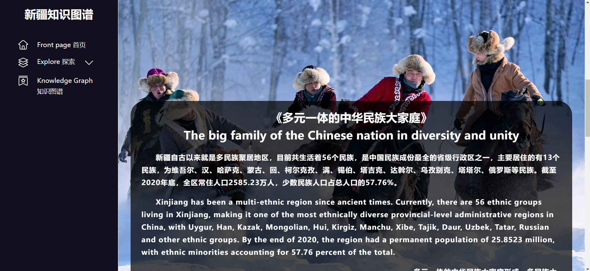

# 基于知识图谱的新疆民族文化大数据平台

#### 项目演示地址
 http://falldeep.gitee.io/xinjiangknowledge

#### 介绍
    基于知识图谱的新疆民族文化大数据平台是一个纯前端项目。
    利用的技术为html、css、js。
    主要分为三个界面
    1.首页界面,采用了动态的背景
    2.各少数民族介绍界面
    3.新疆少数民族知识图谱界面

    1.首页界面,采用了动态的背景

    2.各少数民族介绍界面

    3.新疆少数民族知识图谱界面

    知识图谱的可视化利用echarts库，数据存储在echarts.js中，同时利用mysql.js可以将相关的知识图谱节点转化为sql语句，插入mysql中

#### 软件架构
软件架构说明
分为css、js、html三个文件夹

#### 使用说明
1.  双击index.html即可运行
2.  解压后不要移动位置，因为网页资源加载采用相对定位

#### 特别声明
1.  本知识图谱中的数据来源百度百科
2.  如有错误数据，请批评指正，我们会将其删除

